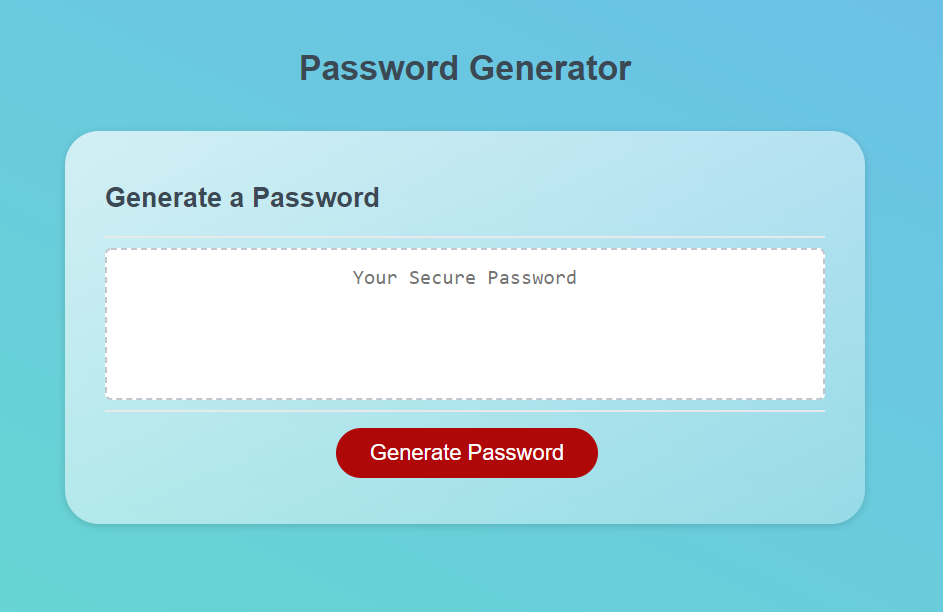

# Random Password-Generator

1. [Description](#desc)
2. [Web Address](#web)
3. [Usage Tips](#usage)
4. [Contributing](#contr)
5. [License](#license)

<a name="desc"></a>

## 1. Description

### This Random Password-Generator will generate a password based on user's input choices. It's also a responsive app which will work on handheld devices.

Desktop Version:



Responsive (Handheld) Version:


<a name="web"></a>

## 2. How to Get There

Click on the below link to access the Portfolio

https://hrsautomation20.github.io/password-generator/

<b>OR</b><br> Copy and past below URL to your favorite browser

```html
https://hrsautomation20.github.io/password-generator/
```

---

<a name="usage"></a>

## 3. Usage Tips

### Follow the criteria instructions to generate a password matching the user's input

To Generate Password Successfully follow below steps:

### Click Generate Password Button once the app is open


### Possible criteria options to choose from

# Enter the number of characters that you would like to be on the password

# Select OK to confirm if you would like lowercase in your password (OK = Yes; Cancel = No)

# Select OK to confirm if you would like uppercase in your password (OK = Yes; Cancel = No)

# Select OK to confirm if you would like numbers in your password (OK = Yes; Cancel = No)

# Select OK to confirm if you would like special characters in your password (OK = Yes; Cancel = No)


### Once all the criteria are met password will be generated as below, you can copy and paste to secure location.


<a name="contr"></a>

## 4. Contributing

For the Password-Generator tool enhancement please contact the repo owner and provide the feedback. For local copy pull/download.zip files are welcome.

---

<a name="license"></a>

## 5. License

No License are required

---

© 2021 HR All Rights Reserved.
